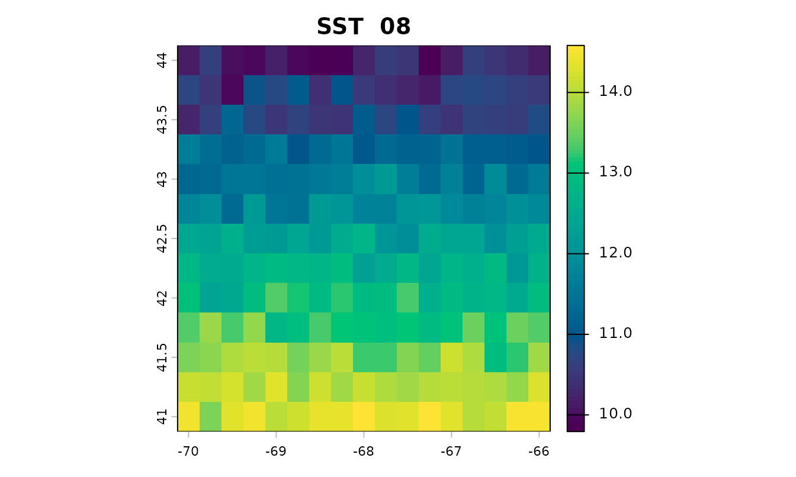
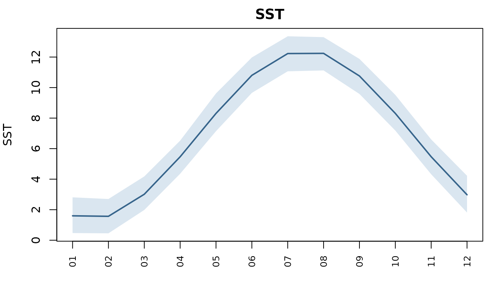
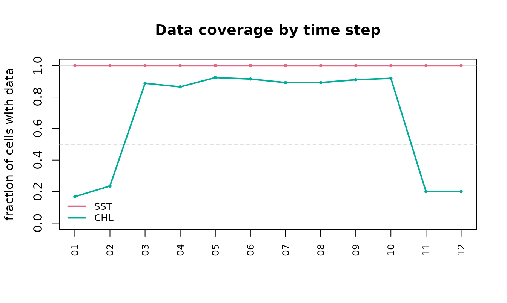

# Getting started with datamatch

This walks a set of observations from raw positions to a table a model
can be fitted to, and shows what each step actually returns.

Every number and figure below is computed when the vignette is built.
Nothing is downloaded: the covariates are synthetic, generated to look
like a Gulf of Maine grid with a seasonal cycle and satellite cloud
gaps. The calls are the ones you would make against real data, so a
fetch is the only thing to substitute.

``` r

bb <- list(xmin = -70, xmax = -66, ymin = 41, ymax = 44)

env <- accessCopernicus(vars = c("SST", "MLD"), years = 2015, months = 1:12,
                    bounding_box = bb)
```

[`accessCopernicus()`](https://chross22.github.io/datamatch/reference/accessCopernicus.md)
returns one row per grid cell per time step, as an `sf` point object:

``` r

env
#> Simple feature collection with 2652 features and 5 fields
#> Geometry type: POINT
#> Dimension:     XY
#> Bounding box:  xmin: -70 ymin: 41 xmax: -66 ymax: 44
#> Geodetic CRS:  WGS 84
#> First 10 features:
#>         SST      MLD YEAR MONTH DAY          geometry
#> 1  3.530795 75.91602 2015     1   1    POINT (-70 41)
#> 2  3.733319 74.01873 2015     1   1 POINT (-69.75 41)
#> 3  3.478501 74.88672 2015     1   1  POINT (-69.5 41)
#> 4  4.086228 72.43991 2015     1   1 POINT (-69.25 41)
#> 5  3.769785 81.31905 2015     1   1    POINT (-69 41)
#> 6  3.482291 74.91623 2015     1   1 POINT (-68.75 41)
#> 7  3.809265 71.09309 2015     1   1  POINT (-68.5 41)
#> 8  3.871989 76.50121 2015     1   1 POINT (-68.25 41)
#> 9  3.831353 76.69915 2015     1   1    POINT (-68 41)
#> 10 3.611061 72.95215 2015     1   1 POINT (-67.75 41)
```

## Look before you model

Three plots answer the questions worth asking of a download, and each
returns the data it drew rather than only drawing it.

[`plot_env()`](https://chross22.github.io/datamatch/reference/plot_env.md)
maps one variable for one time step. This is the fastest way to catch a
bounding box that landed somewhere unintended, or a variable that is
entirely `NA`:

``` r

plot_env(env, "SST", time = c(MONTH = 8))
```



[`plot_series()`](https://chross22.github.io/datamatch/reference/plot_series.md)
reduces each step to one number over the study area, so the seasonal
cycle and its spatial spread are both visible:

``` r

series <- plot_series(env, "SST")
```



``` r

head(series, 4)
#>   variable step label    value     lower    upper
#> 1      SST    1    01 1.599484 0.4711648 2.809843
#> 2      SST    2    02 1.566979 0.4521412 2.700704
#> 3      SST    3    03 3.013007 1.9838243 4.179774
#> 4      SST    4    04 5.467445 4.3553468 6.525119
```

## Gaps are not spread evenly

Satellite variables are missing wherever cloud blocked the view, and
those gaps cluster in particular seasons. Adding a chlorophyll field
with realistic winter gaps:

``` r

env$CHL <- 1.2 + 2.4 * exp(-((env$MONTH - 5)^2) / 5) + stats::rnorm(nrow(env), 0, 0.1)

winter <- env$MONTH %in% c(11, 12, 1, 2)
env$CHL[winter][sample(sum(winter), round(sum(winter) * 0.8))] <- NA
env$CHL[!winter][sample(sum(!winter), round(sum(!winter) * 0.1))] <- NA
```

[`plot_coverage()`](https://chross22.github.io/datamatch/reference/plot_coverage.md)
is the one to run before trusting a monthly mean:

``` r

coverage <- plot_coverage(env, c("SST", "CHL"))
```



``` r

round(coverage$coverage[coverage$variable == "CHL"], 2)
#>  [1] 0.17 0.24 0.89 0.86 0.92 0.91 0.89 0.89 0.91 0.92 0.20 0.20
```

A quarter of the grid in winter and near-complete in summer is exactly
the shape that decides whether a winter value means anything.

## Matching

[`matchData()`](https://chross22.github.io/datamatch/reference/matchData.md)
joins each observation to the nearest cell within the same time period.
Some observations here are deliberately placed in a month the covariates
do not cover, and some outside the grid:

``` r

observations <- sf::st_as_sf(
  data.frame(
    lon   = c(-69.5, -68.2, -67.1, -66.5, -69.0, -64.0),
    lat   = c(41.5,  42.3,  43.1,  41.9,  43.6,  42.0),
    YEAR  = 2015L,
    MONTH = c(3L, 6L, 8L, 6L, 11L, 6L),
    count = c(12, 45, 7, 88, 3, 21)
  ),
  coords = c("lon", "lat"), crs = 4326)

matched <- matchData(observations, env)
sf::st_drop_geometry(matched)[c("MONTH", "count", "SST", "MLD", "CHL")]
#>   MONTH count       SST      MLD      CHL
#> 1     3    12  4.595216 68.79593 2.382153
#> 2     6    45 10.975591 22.73822 3.127191
#> 3     8     7 11.694670 13.99398 1.475718
#> 4     6    88 11.291059 22.38248 3.175495
#> 5    11     3  4.177107 50.49188       NA
#> 6     6    21 11.425503 25.23311       NA
```

Every observation comes back, in the same order, with the covariates
attached. The last one sits well outside the grid and still matched —
[`matchData()`](https://chross22.github.io/datamatch/reference/matchData.md)
uses the *nearest* cell, and nearest has no maximum distance. That is
worth knowing: an observation far outside the study area is joined to
the closest edge cell rather than dropped, so check your bounding box
covers your stations.

The November observation has `NA` chlorophyll, because that cell was
under cloud. That is a real gap rather than a failure, and the source of
it is worth checking before dropping the row:

``` r

colSums(is.na(sf::st_drop_geometry(matched)))
#>  YEAR MONTH count   SST   MLD   CHL   LON   LAT 
#>     0     0     0     0     0     2     0     0
```

## Choosing a resolution

Real products do not share a grid. Physics is 0.083°, biogeochemistry
0.25°, and satellite ocean colour 4 km, so combining them means deciding
which grid to keep.

Aggregating is the safe direction, because every value in the result
summarises values that were really measured:

``` r

coarse <- upscale_grid(env, to = 0.5, vars = "SST", min_coverage = 0)

c(cells_before = nrow(env) / 12, cells_after = nrow(coarse) / 12)
#> cells_before  cells_after 
#>          221           48
```

Interpolating is the direction to be careful in. It adds cells, not
information:

``` r

fine <- downscale_grid(coarse, to = 0.25, vars = "SST")

# `nearest`, the default, invents no values: every one was already in the source.
all(stats::na.omit(fine$SST) %in% coarse$SST)
#> [1] TRUE
```

`bilinear` would return a smooth field that looks like a finely-resolved
measurement and is not, which is why the blunt method is the default.

### Partial coverage comes back NA

Aggregating chlorophyll over the winter, when most cells are empty, is
the case `min_coverage` exists for:

``` r

january <- env[env$MONTH == 1, ]

strict <- upscale_grid(january, to = 0.5, vars = "CHL", min_coverage = 0.5)
loose  <- upscale_grid(january, to = 0.5, vars = "CHL", min_coverage = 0)

c(reported_at_half_coverage = sum(!is.na(strict$CHL)),
  reported_with_no_guard    = sum(!is.na(loose$CHL)))
#> reported_at_half_coverage    reported_with_no_guard 
#>                         1                        39
```

Both numbers are available; only one of them says how much went into it.
`keep_counts = TRUE` returns the fraction behind each value.

## Covariates that are not gridded

Two other kinds attach differently. Seafloor terrain is static, so the
same value goes to every time step at a location:

``` r

bathy <- fetch_bathymetry(bounding_box = bb)
matched <- attach_bathymetry(matched, bathy, c("DEPTH", "SLOPE", "TPI"))
```

Climate indices have no spatial dimension at all — one value per month
describes the whole basin, so every observation in a month receives the
same number:

``` r

matched <- attach_climate_index(matched, c("NAO", "AMOC"))
```

That makes them a different kind of covariate. They carry information
about *when*, and none about *where* within a region conditions are
better. A model given only indices cannot produce a map.

``` r

as.data.frame(index_dictionary())[c("name", "units", "source")]
#>   name                units                                    source
#> 1  NAO standardized anomaly                                  NOAA CPC
#> 2   AO standardized anomaly                                  NOAA CPC
#> 3  AMO            degrees C                                  NOAA PSL
#> 4  PDO standardized anomaly                                  NOAA PSL
#> 5  LCR             fraction Jutras et al. 2023, Nature Communications
#> 6 AMOC                   Sv           RAPID-MOCHA-WBTS array at 26.5N
```

## Where to go next

- [`vignette("datamatch")`](https://chross22.github.io/datamatch/articles/datamatch.md)
  is this document; the [README](https://github.com/chross22/datamatch)
  covers the same ground in more depth, including forecasts, daily data,
  and gap filling.
- [`variable_dictionary()`](https://chross22.github.io/datamatch/reference/variable_dictionary.md)
  and
  [`index_dictionary()`](https://chross22.github.io/datamatch/reference/index_dictionary.md)
  list what can be fetched.
- The README’s References section lists the DOI for every data source,
  since the obligation to cite travels with the data.
